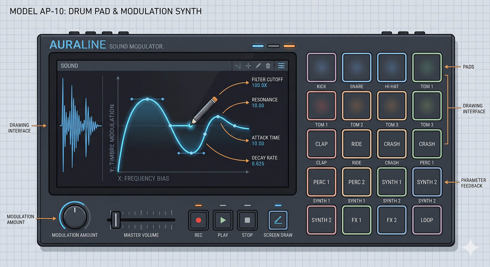
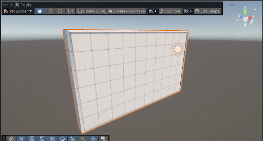
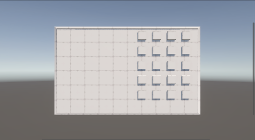
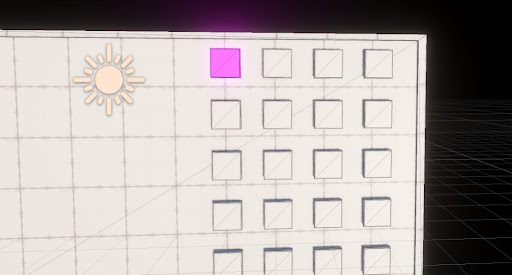
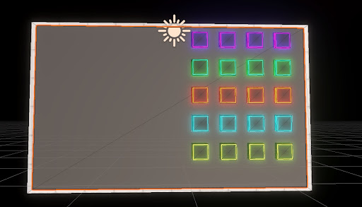
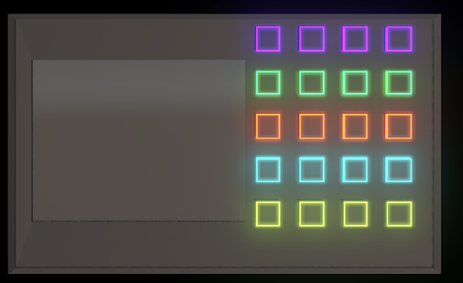
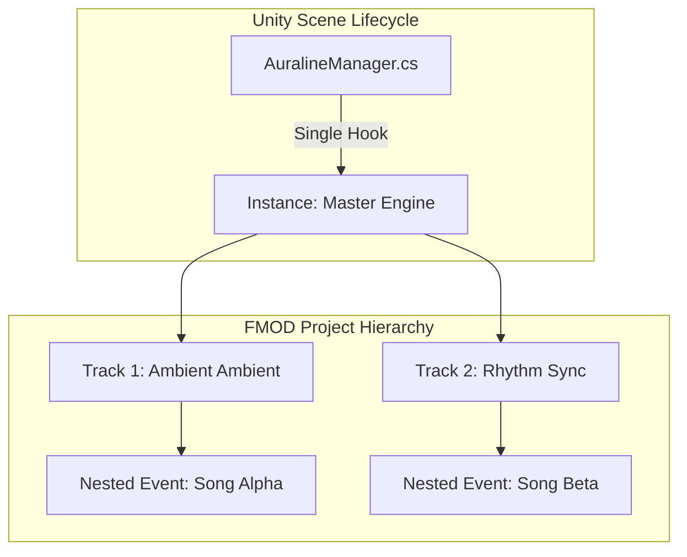

# Final Major Project

## Project Outline

---

**Auraline** is an interactive audio-visual synthesis application built in **Unity** that bridges the gap between digital sound design and physical gesture. The project explores the intersection of psychology, visual art, and audio perception, focusing on how human beings process and interact with multisensory stimuli. While stylistically and technically inspired by historical systems like the [**Xenakis UPIC**](https://en.wikipedia.org/wiki/UPIC) and the [**Oramics Machine**](https://en.wikipedia.org/wiki/Oramics), the application eschews traditional, button-heavy interfaces in favor of a clean, gesture-based "drawing-to-sound" experience driven by the **FMOD** audio engine. A core feature is the implementation of a theatrical "Power-Up" sequence and reactive material emissions that provide immediate visual feedback for real-time audio modulation.

For instance, the application utilizes a 2D interactive drum pad and a **"Ghost Pen"** tutorial system to guide users through the synthesis process. The pen leaves a dynamic trail teaching the user the mechanics of the interface before they begin their own performance. Importantly, the system utilizes sequential visual "breadcrumbs," where elements like the **Reset** and **Next Track** buttons only fade into existence as the user requires them, prioritizing an immersive, minimal interface over traditional HUD-heavy layouts.

---

### Minimal Goal - Decent Audio-Visual Mechanic

The visual-audio interface is the core for **Auraline** and the central focus of development. The minimum standard of delivery for the project is a good interactive interface that modifies the audio based on the user's mouse motion (drawings).

#### Key Objectives:
- Compact design with simplistic visual instructions to keep optimal engagement.
- Self-produced audio by exploring different genres and sampling techinques.
- Implement a responsive interface that binds drawing and audio modifications flawlessly through drawings.

#### Anticipated Challenges:
- Designing a 3D model of an interface that is not too confusing or too minimalistic.
- Producing and arranging melodies could take a good portion of my time and slowing down development.
- Fluid responses between FMOD events and Unity through coding that detects the mouse moves and responds accordingly.

---

### Desired Goal - Polished Interface And Multiple Audios

A visually appealing interface is the second goal for this project, intended to provide a decent variety of buttons that turn on or off audio effects. This will allow the user to modify the sound as he pleases. Integrating multiple songs would give the opportunity to choose the most outstanding one while keeping gameplay at optimal levels.

#### Key Objectives:
- Design buttons in a way that encourages engagement, maybe through emmissive materials to draw visual attention from the user.
- Integrate two or three more melodies with transitions to keep the playable loop consistent and not lose the user's attention span.
- Colourful drawing line to bind the visual and audio stimulus and turn a passive action (listening to music) into an active one.

#### Anticipated Challenges:
- Not overflowing the interface with unneccessary buttons that will draw the user's attention from the main screen, removing completly the purpose of the project.
- Without a designated room and equipment, producing might be difficult due to me only having a laptop and no MIDI or keyboard, resulting in a sloppy and simple production process that is not up to the industry standards.
- Missing a proper allignment of many game objects in Unity will result in errors and the designated screen might not detect the drawing line or the movements as intended.

---

### Aspirational Goal - Fully Developed Project

Achieving a finalised product to the highest standard, both mechanically and visually, is the foundational requirement for establishing a seamless, uncompromised link between human gesture and real-time audio synthesis.

#### Key Objectives:
- A well designed and quick responsive screen for drawing, simple visual cues and instructions for the user, only neccesary pads for audio effects, appealing 3D model.
- Multiple songs added with a good amount of audio parameters that are linked to Unity and allows the user to explore different outcomes of how visuals and audios are linked.
- Creating a highly optimized, lightweight rendering pipeline that guarantees a rock-solid, high-framerate experience on portable hardware like a MacBook Air, supported by modular C# code that allows developer-friendly expansions for future audio tracks and pad layouts.

### Anticipated Challenges:
- Mapping 2D inputs onto a 3D console surface with zero latency, while relying entirely on visual cues to preserve a precise, text-free minimalist aesthetic.
- Synchronizing complex Unity-FMOD parameter mappings across multiple tracks without bottlenecks, ensuring visual inputs consistently drive predictable, meaningful audio changes.
- Preventing frame-drops and memory fragmentation on a MacBook Air from real-time line drawing and emission overrides, requiring optimized, decoupled C# scripts for scalable performance.

---

## Research

In shaping the technical direction and sensory interaction of **Auraline**, the research framework was structured around a multi-disciplinary approach bridging first-party software engineering with procedural audio design, color psychology, and historic graphic synthesis frameworks.

### Architectural Design and Complexity Management
To ensure a clean, decoupled, and highly performant C# architecture, the project relied heavily on optimization blueprints aimed at reducing systemic complexity. Managing this data flow is a baseline necessity when mapping real-time, interactive 2D coordinates onto 3D surfaces while simultaneously driving dynamic middleware sound parameters. As industry systems designers emphasize, the failure to decouple graphic loops from audio execution pipelines leads to catastrophic performance bottlenecks. Technical author Robert Nystrom highlights this concept in *Game Programming Patterns*:

> "Decoupling components ensures that game systems can evolve and execute independently without rippling performance flaws across unrelated domains." [(Nystrom, 2014)](https://gameprogrammingpatterns.com/component.html)

By adhering to strictly modular engineering patterns, Auraline isolates its visual material calculations from its active audio buses, guaranteeing consistent runtime frames.

### Up-to-Date Engine and Middleware Integration
For platform-specific implementation, the project prioritized official, first-party documentation released directly by **Unity Technologies** and **Firelight Technologies** over unofficial, third-party tutorials. Because both game engines and audio middleware packages undergo rapid API transformations, older community guides frequently rely on deprecated lifecycle methods, tightly coupled references, and unoptimized logic. This issue is widely acknowledged within the development community, with engine programmers stating on community forums that:

> "Legacy, community-made integration tutorials are hopelessly broken due to massive core architecture rewrites, and authors rarely update their source material to reflect updated node or script behavior." [(Unity/FMOD Developer Forum, 2024)](https://qa.fmod.com/t/lots-of-warnings-in-unity-6-2/23701)

To protect the development workflow from console pollution and compile-time failures—such as the known FMOD `TreeView` deprecation warnings on newer engine versions—the project leaned strictly on official samples. This ensured that features like memory-safe coroutines and event-driven data tracking function seamlessly on a portable **macOS (MacBook Air)** development environment.

---

## Sources

#### 1. [FMOD Studio Unity Integration Documentation](https://www.fmod.com/docs/2.03/unity/api-runtimemanager.html)
Published by **Firelight Technologies**, the creator of the industry-standard FMOD Studio audio middleware engine, this official scripting API reference guide is widely respected for its deep technical clarity and platform-agnostic stability ([Firelight Technologies, 2024](https://www.fmod.com/docs/2.03/unity/api-runtimemanager.html)). This source was critical to the architectural development of Auraline because it details the precise C# classes, methods, and memory structures required to instantiate runtime event instances, manipulate mixer properties, and pass data from Unity into dynamic audio buses safely.

* **Playback Tracking:** Analyzed the `FMOD.Studio.PLAYBACK_STATE` enumerations to track when a musical track is actively playing, paused, or stopped, allowing for perfect coordination with visual pad emissions ([Firelight Technologies, 2024](https://www.fmod.com/docs/2.03/api/studio-api-eventinstance.html#studio-playback-state)).
* **Lifecycle Management:** Studied the `StudioEventEmitter` and native `EventInstance` lifecycle architectures to execute memory-safe audio triggers, effectively preventing audio voice leakage and resource over-allocation during continuous drawing loops ([Firelight Technologies, 2024](https://www.fmod.com/docs/2.03/unity/api-studioeventemitter.html)).
* **Parameter Passing:** Evaluated real-time parameter-setting protocols like `setParameterByName` to establish a smooth pipeline where real-time coordinate math from drawing inputs translates seamlessly into fluid parameter changes without causing audible digital artifacts ([Firelight Technologies, 2024](https://www.fmod.com/docs/2.03/unity/api-runtimemanager.html)).

This documentation was exceptionally useful for establishing a performant and highly responsive connection between the visual interface and the background audio mix. However, a limitation within the FMOD Unity integration package was a substantial volume of deprecated `TreeView` and `TreeViewState` warnings (`CS0618`) generated within its custom editor files when compiling on newer engine versions ([FMOD Q&A Forum, 2024](https://qa.fmod.com/t/lots-of-warnings-in-unity-6-2/23701)). While these warnings do not disrupt runtime audio playback, they clutter the editor console and require manual filtering during development.

```
+--------------------------+                  +---------------------------+
|    UNITY EVENT LAYER     |                  |     FMOD MIXING BUS       |
|  2D Screen Coordinates   | --(C# API Link)->|   setParameterByName()    |
|  & Contact Capacitance   |                  |  Dynamic Parameter Curve  |
+--------------------------+                  +---------------------------+
```
*Figure 1. Event-driven data flow between Unity input and FMOD parameter modulation.*

#### 2. [Unity Advanced Programming Architecture Manual](https://unity.com/how-to/advanced-programming-and-code-architecture)
Published by **Unity Technologies**, this official platform documentation represents the absolute authority on the engine’s underlying lifecycle methods, rendering pipelines, and memory optimization guidelines ([Unity Technologies, 2024](https://docs.unity3d.com/Manual/index.html)). It was crucial to this project for establishing the programmatic foundations of the interactive drawing pad, controlling environmental parameters, and automating the local development environment.

* **Time Slicing & Coroutines:** Mastered the lifecycle of the `Coroutine` class and the use of `yield return new WaitForSeconds()` to decouple the 5-second theatrical "void" delay from the primary update loop, preventing frame stutter during startup ([Unity Technologies, 2024](https://docs.unity3d.com/Manual/Coroutines.html)).
* **Shader Property Modification:** Analyzed the `Material.SetColor` and `_EmissionColor` shader properties to modify real-time emission data on standard materials without creating a heavy memory footprint through duplicate texture instantiations ([Unity Technologies, 2024](https://docs.unity3d.com/ScriptReference/Material.SetColor.html)).
* **Particle & Trail Geometry:** Studied the geometry pooling behaviors of the `TrailRenderer` component, which led to identifying the need for a structural "Pivot Container" hierarchy to align the trail generation precisely with the tip of the custom 3D pen model ([Unity Technologies, 2024](https://docs.unity3d.com/Manual/class-TrailRenderer.html)).
* **Editor Automation:** Investigated the `[InitializeOnLoad]` attribute and the `EditorApplication.delayCall` class to write an automated pipeline script that forces the project to always open to the Auraline pad scene across distributed version control setups ([Unity Technologies, 2024](https://docs.unity3d.com/ScriptReference/InitializeOnLoadAttribute.html)).

The Unity documentation provided the absolute structural blueprint required to build optimized, decoupled C# scripts that bypass unnecessary engine overhead. Its only minor limitation is that its general UI and trail documentation assumes standard, HUD-heavy game setups, meaning that customizing these components for an unconventional, zero-HUD "drawing-to-sound" tool required significant algorithmic adaptation and custom mathematical overrides ([Unity Discussions, 2024](https://discussions.unity.com/t/when-unity-is-going-to-remove-obsolete-properties-from-component-class/757365)).

---

#### 3. [Tsugi DSP Action Product Suite](https://tsugi-studio.com/web/en/products-dspmotion.html)
Developed by **Tsugi Studio**, a Tokyo-based leader in procedural game audio tools, this professional sound design suite is highly respected for its ability to synthesize complex sound effects in real-time based on live user gestures ([Tsugi Studio, 2020](https://tsugi-studio.com/web/en/products-dspmotion.html)). This product was uniquely valuable to Auraline because it provided a validated commercial proof-of-concept demonstrating how hand velocity, stroke angles, and coordinate vectors can act as fluid, expressive sound modifiers.

* **Gestural Interactivity:** Analyzed Tsugi's core workflow of utilizing a 2D "Sketch Pad" where the position, acceleration, and cross-line interactions of a drawing tool drive audio variations rather than triggering pre-recorded, repetitive wave samples ([Tsugi Studio, 2020](https://tsugi-studio.com/web/en/products-dspmotion.html)).
* **Material Mapping:** Studied the integration pipeline of their procedural audio models, noting how they map specific material properties (such as glass, metal, and digital synths) directly to continuous structural modifiers ([WaveInformer, 2024](https://waveinformer.com/2024/02/27/tsugi-software/)).
* **Visual-Audio Cohesion:** Evaluated their method of maintaining real-time video and graphic synchronization to see how visual feedback loop designs can subconsciously enhance the feel of an auditory interface ([Synth and Software, 2022](https://synthandsoftware.com/2022/11/draw-motion-sfx-with-a-mouse-tsugi-dsp-motion-and-dsp-action/)).

DSP Action was highly influential in defining Auraline’s user interaction loop. It proved that mapping user-drawn vector coordinates directly to real-time modulation curves results in a highly expressive and intuitive tool that prevents user ear fatigue ([Tsugi Studio, 2020](https://tsugi-studio.com/web/en/products-dspmotion.html)). Observing Tsugi's implementation directly inspired Auraline's shift away from generic button-pushing interfaces toward a continuous, fluid drawing workspace that prioritizes physical motion ([WaveInformer, 2024](https://waveinformer.com/2024/02/27/tsugi-software/)).


*Figure 2. Tsugi DSP Motion user interface demonstrating the gestural drawing-to-sound workflow, where mouse or tablet vector inputs map directly to procedural audio synthesis and real-time visual synchronization.*

---

#### 4. [ZKM Karlsruhe: From Xenakis's UPIC to Graphic Notation Today](https://zkm.de/en/from-xenakiss-upic-to-graphic-notation-today)
Published by the **ZKM Center for Art and Media**, this comprehensive academic compilation tracks the genesis and evolution of the **UPIC (Unité Polyagogique Informatique du CEMAMu)** system—a computational synthesis tool developed by the avant-garde composer and architect Iannis Xenakis in the late 1970s ([Weibel, Brümmer and Kanach, 2020](https://zkm.de/en/from-xenakiss-upic-to-graphic-notation-today)). This resource stands as the primary historical and artistic justification for Auraline, establishing a professional lineage for transforming hand-drawn geometric illustrations into audio waveforms.

* **Vector Composition:** Analyzed the historical technique of utilizing a digitizing tablet to translate structural drawing strokes directly into specific wave frequencies, pitches, and durations ([Pietruszewski, 2020](https://zkm.de/en/from-xenakiss-upic-to-graphic-notation-today)).
* **Macro-Form Notation:** Studied how architectural vector lines can be reimagined as macro-level musical scores, breaking down the rigid limits of traditional Western sheet music ([Scordato, 2020](https://zkm.de/en/from-xenakiss-upic-to-graphic-notation-today)).
* **Menu-Less Frameworks:** Explored the user workflow of the UPIC, discovering that eliminating text menus entirely allows non-musicians and artists to immediately compose audio through pure spatial expression ([Després, 2020](https://zkm.de/en/from-xenakiss-upic-to-graphic-notation-today)).

Reviewing this historical system was incredibly useful for validating the creative direction of Auraline, confirming that abstract visual contours possess an inherent, powerful relationship with musical arrangement ([Weibel, Brümmer and Kanach, 2020](https://zkm.de/en/from-xenakiss-upic-to-graphic-notation-today)). The primary limitation of this research source is that the original UPIC relied on massive, custom, legacy mainframe hardware of the late 20th century, meaning its historical documentation offers no direct modern software answers. The core engineering challenge was translating Xenakis's grand compositional philosophy into optimized, lightweight C# logic that runs natively on a modern MacBook Air.

---

#### 5. [Crossmodal Correspondences and Multi-Sensory Mapping](https://link.springer.com/article/10.3758/s13414-010-0073-7)
This highly cited peer-reviewed paper by Dr. Charles Spence, head of the Crossmodal Research Laboratory at the University of Oxford (*Attention, Perception, & Psychophysics*), provides an empirical cognitive psychology framework for cross-modal mapping ([Spence, 2011](https://link.springer.com/article/10.3758/s13414-010-0073-7)). The research focuses on how the human brain naturally and consistently links distinct visual attributes (such as spatial height, brightness, and size) with specific auditory dimensions (such as pitch, loudness, and timbre). This academic source was essential for justifying Auraline's design choices, proving that the relationships between visual drawing coordinates and sound outputs are backed by universal human cognitive patterns rather than being completely arbitrary.

* **Spatial-Pitch Correspondences:** Analyzed the fundamental neurological pairing between vertical space and audio frequency, confirming that humans naturally expect higher positions on a 2D interface to generate higher musical pitches ([Spence, 2011](https://link.springer.com/article/10.3758/s13414-010-0073-7)).
* **Brightness-Loudness Alignment:** Studied how visual intensity and color saturation map directly to acoustic volume and filter configurations, validating the synchronization of bright material emissions with intense audio dynamics ([Spence, 2011](https://link.springer.com/article/10.3758/s13414-010-0073-7)).
* **Implicit UX Design Frameworks:** Investigated how leveraging pre-existing cross-modal connections reduces cognitive load, showing that building an interactive interface around natural sensory expectations removes the need for explicit text-based instructions or a cluttered HUD ([Spence, 2011](https://link.springer.com/article/10.3758/s13414-010-0073-7)).

This research was incredibly valuable for calibrating the math behind Auraline's interactive drawing board, ensuring that data sent from Unity's 2D space maps to FMOD parameters in a way that feels instantly intuitive to the user. By basing the interaction logic on established cognitive science, the system achieves a true "Zero-UI" flow where the interface feels natural from the first stroke. The primary limitation of this paper is its focus on controlled laboratory testing rather than live digital tools, meaning its insights had to be manually translated into real-time C# scaling algorithms and continuous FMOD modulation curves.

---

## Implementation

### Visual Representaion Of Auraline

---

I kicked off development by bridging the gap between tactile performance and fluid, visual sound synthesis. The goal was to establish a clear visual blueprint before diving into Unity, resulting in the Auraline AP-10 concept mock-up. I have asked Gemini to generate a 2D model of a drum pad with a screen used for drawing and modifying sounds. This was the result:



*Figure 3. Auraline AP-10 user interface demonstrating the hybrid tactile triggering and gestural drawing-to-sound workflow, where vector-based screen inputs map directly to procedural modulation envelopes and real-time visual spectrum synchronization.*

This high-fidelity mock-up serves as my definitive UI anchor, defining the spatial layout, color-coded parameter feedback, and asset requirements before turning the canvas into a 3D model in Unity.

---

### Using Pro Builder

While Unity’s primitive 3D shapes worked for a basic block-out, they quickly became a bottleneck for the **Auraline** chassis. Fabricating the recessed screen, sloped panel indents, and edge bevels by nesting and scaling dozens of separate primitive GameObjects cluttered the hierarchy and restricted our texture mapping.

Switching to **ProBuilder** directly within Unity streamlined the pipeline:

* **In-Editor Modeling:** I will be able to sculpt the custom hardware casing and screen cavities directly in the scene view, avoiding the friction of shifting to external 3D software.
* **Optimized Meshes:** ProBuilder combines complex geometry into a single, clean mesh, drastically reducing GameObject bloat.
* **Granular UV Control:** This was crucial for mapping the detailed interface textures onto the hardware precisely without stretching.

Transitioning to ProBuilder allowed me to quickly iterate on the physical form of the drum pad while keeping the project structure clean and optimized. Through images, below I will display the process of modelling the interface.



*Figure 4. Using ProBuilder to define the initial 3D slab for the chassis, establishing the hardware footprint and edge profile directly in the Unity scene view.*

---



*Figure 5. Populating the right side of the interface with a precise 4x5 grid array of physical performance pads, establishing the tactile control zone.*

---



*Figure 6. Testing a high-intensity magenta emissive material on a single pad to calibrate baseline bloom, lighting behavior, and visual feedback constraints.*

---



*Figure 7. Expanding the emissive material passes across the entire grid, implementing color-coded rows to visually categorize instrument groups and parameter states.*

---



*Figure 8. Utilizing ProBuilder's face editing to extrude and bevel the left side of the chassis inward, creating the finalized, matte hardware cavity dedicated to the drawing interface.*

---

## FMOD Implementation In Unity

### FMOD Event

When laying down the initial technical foundation for **Auraline**, the primary objective was to validate the core drawing-to-sound translation pipeline without adding the complexity of asset-heavy UI systems or dynamic track variations. The initial development scope focused entirely on an isolated system configuration: **one song loop housed inside a single, continuous audio event layer**.

According to the official [FMOD Studio Concepts Manual](https://www.fmod.com/docs/2.03/studio/fmod-studio-concepts.html), an **Event** is defined as:
> *"An instanceable unit of sound content that can be triggered, controlled and stopped from game code. As a rule, every situation in your game that produces a sound should have a corresponding event."*

In this early phase, a single event called `event:/p1` was created within FMOD Studio. This event contained the full multi-track layout of the baseline musical composition, controlled internally by continuous user parameters (e.g., `PitchShift` and `ReverbAmount`) rather than standard timeline cues.

### Linking Modulations via Drawing

Separating spatial calculations (`AuralineScreenInteraction`) from audio execution (`AuralineAudioManager`) was essential for creating a clean, high-performance drawing-to-sound pipeline. 

This decoupled architecture achieves a robust integration through three main advantages:

* **Hardware-Agnostic Mapping:** Raycast hits are normalized to an invariant `0.0 to 1.0` range based on the ProBuilder mesh bounds rather than using raw screen vectors. This ensures that if the physical chassis is scaled, rotated, or modified later, the input tracking remains completely accurate without code recalibration.
* **Low-Overhead DSP Pipeline:** Passing these normalized values directly into FMOD’s `setParameterByName` bypasses heavy intermediate calculations. This delivers highly efficient, sample-accurate runtime modulation over pitch and reverb directly within the native audio mixer.
* **Synchronous Multi-Sensory Feedback:** Processing both the FMOD mixer states and the visual rendering variables (`currentSpeed`, `currentSmooth`) inside a unified frame loop eliminates perceived latency. The result is seamless synchronization between touch gestures, spectrum deformation, and audio modification.

```csharp
using UnityEngine;
using UnityEngine.InputSystem;

public class AuralineTouchHandler : MonoBehaviour
{
    [Header("Screen References")]
    [SerializeField] private Collider screenCollider;
    [SerializeField] private Transform screenCursor;

    [Header("Runtime Parameter Outputs")]
    private float pitchLevel;
    private float reverbLevel;

    // Public properties to expose values to the Audio Manager
    public float PitchLevel => pitchLevel;
    public float ReverbLevel => reverbLevel;

    private void Update()
    {
        // Continuously check for pointer interaction
        if (Pointer.current != null && Pointer.current.press.isPressed)
        {
            HandleTouch();
        }
        else
        {
            // Hide cursor when interaction ceases
            if (screenCursor != null && screenCursor.gameObject.activeSelf)
            {
                screenCursor.gameObject.SetActive(false);
            }
        }
    }
```
*Figure 9. C# implementation of the AuralineTouchHandler component tracking real-time user gestures, where Unity's modern Input System polls active pointer pressure to safely manage cursor states and route coordinate data to the mixing pipeline.*

---

```csharp
void HandleTouch()
    {
        Vector2 pointerPos = Pointer.current.position.ReadValue();
        Ray ray = Camera.main.ScreenPointToRay(pointerPos);
        RaycastHit hit;

        if (Physics.Raycast(ray, out hit))
        {
            // This tells us exactly what we hit in the Console
            Debug.Log("Auraline Raycast hit: " + hit.collider.gameObject.name);

            // CHANGED: We check the GameObject now, which is safer
            if (hit.collider.gameObject == screenCollider.gameObject)
            {
                if (screenCursor != null)
                {
                    screenCursor.gameObject.SetActive(true);
                    screenCursor.position = hit.point + (hit.normal * 0.005f);
                }

                // Get the bounds of the collider we actually hit
                Bounds b = hit.collider.bounds;
                
                // Calculate percentages (0 to 1)
                float xPct = Mathf.Clamp01((hit.point.x - b.min.x) / b.size.x);
                
                // --- THE ORIENTATION FIX ---
                // Try 'y' if your screen is vertical (like a wall)
                // Try 'z' if your screen is horizontal (like a table)
                float yPct = Mathf.Clamp01((hit.point.y - b.min.y) / b.size.y); 

                pitchLevel = Mathf.Lerp(-12f, 12f, xPct);
                reverbLevel = Mathf.Lerp(0f, 1f, yPct);
                
                Debug.Log($"Mapped Values: Pitch {pitchLevel:F1} | Reverb {reverbLevel:F1}");
            }
        }
    }
```
*Figure 10. C# implementation of the HandleTouch algorithm handling spatial-to-parameter normalization, where 3D physics raycasting isolates the mesh bounds of the screen to translate surface coordinate percentages directly into mapped pitch and reverb modifiers.*

---

### FMOD Nested Events

As the core song catalog of **Auraline** expanded beyond the initial single-track proof of concept, maintaining completely independent master events for each track created significant workflow clutter inside both the Unity editor and the FMOD project hierarchy. To manage this scalability challenge without abandoning my decoupled C# framework, the audio pipeline was restructured to utilize parent-child nesting via event instruments.

According to the official [FMOD Studio Instruments Manual: Nested Events](https://www.fmod.com/docs/2.03/studio/authoring-events.html#nested-events), nested events provide an elegant structural solution:
> *"Some referenced events are nested events. Unlike other events, nested referenced events do not appear in the routing browser and cannot be played at runtime except by playing their parent events... The main benefit of nested referenced events is that they do not clutter the routing browser and the browsers of your game editor."*

By creating a singular parent event (e.g., `event:/p1/Auraline_Master`), each individual song loop was implemented as an internal **Event Instrument** embedded directly onto separate tracks within the parent timeline. By default, FMOD allows parameter controls to be exposed recursively up to the parent event, meaning our pre-existing mapping structures for spatial drawing tracking could remain unified under a single control system.


*Figure 11. Architectural routing diagram mapping Unity-to-FMOD integration, where a single master engine instance channels real-time manager data directly into parallel ambient and rhythmic sub-tracks.*

Transitioning to a nested event architecture streamlined the development workflow through three key advantages:

* **Minimized Memory Overhead:** Instead of continuously destroying and instantiating new `EventInstance` blocks at runtime—which risks memory fragmentation—Unity maintains a single parent instance. Track switching is handled efficiently via a global parameter (`TrackSelector`), safeguarding framerate stability on portable hardware like the MacBook Air.
* **Encapsulated Sub-Mixing:** Routing child events directly through the parent channel strip enables a unified master effects chain. This centralized routing streamlines acoustic optimization, ensuring consistent loudness thresholds and compression profiles across all tracks automatically.
* **Unified Parameter Routing:** Because parameters are recursively inherited by the parent event, the baseline coordinate-mapping scripts required zero structural rewrites. The C# layer continues communicating directly with the master instance, while FMOD seamlessly delegates those telemetry inputs downstream to the active child timeline.

https://github.com/user-attachments/assets/49380570-f043-4721-8917-3a6e3560fcd7

*Figure 12. Nested multi-track event structure within FMOD Studio, where a global TrackSelector parameter dynamically crossfades between five distinct musical timelines routed into a unified master DSP modulation chain.*

---

### Advanced Multi-Parameter Modulation: Expanding the Sonic Palette

To evolve **Auraline** from a simple melodic generator into a highly expressive, tactile instrument, the synthesis engine was expanded beyond basic pitch variations and static reverb. By introducing **spatial panning**, **stereo width**, and **distortion** (through drawing intensity), the soundscape reacts not just to *where* the user draws, but *how* they draw.

The audio engine uses three advanced parameters to continuously shape the track sub-mix based on live cursor or touch interactions:

* **Kinetic Drive (`DrawingIntensity`):** Linked to an aggressive overdrive and wave-shaping module within FMOD. This parameter handles the grit and saturation of the synthesizer layer, scaling dynamically between $0.0$ and $1.0$.
* **Panoramic Field (`SpatialPanning`):** Maps the audio signal across a balanced left-to-right stereo panorama. Panning moves dynamically from $0.0$ (hard left) through $0.5$ (center) up to $1.0$ (hard right).
* **Immersive Spread (`StereoWidth`):** Automatically broadens the acoustic field. As the interaction moves away from the center of the drawing surface toward either boundary edge, the signal spreads from a focused mono signal ($0.0$) out to an immersive wide-stereo configuration ($1.0$).

To feed these parameters accurate data, `AuralineController.cs` intercepts vector telemetry through two dedicated functions: `CalculateVelocity()` and `HandleTouch()`. 

##### Step A: Stroke Speed & Kinetic Friction Tracking
Inside `CalculateVelocity()`, the application evaluates the pixel distance traversed between frames. This displacement is divided by delta time, multiplied by a adjustable `velocitySensitivity` coefficient, and smoothed via linear interpolation to eliminate digital audio stepping:

```csharp
void CalculateVelocity()
{
    Vector3 currentMousePos = Pointer.current.position.ReadValue();
    float distance     = Vector3.Distance(currentMousePos, lastFrameMousePos);
    
    // Prevent division by zero if Time.deltaTime is extremely small
    float dt = Mathf.Max(Time.deltaTime, 0.0001f);
    
    // Evaluate velocity and apply a 5.0x modifier for aggressive distortion response
    float currentSpeed = (distance / (dt * 1000f)) * velocitySensitivity;
    drawingIntensity   = Mathf.Clamp01(Mathf.Lerp(drawingIntensity, currentSpeed, dt * 8f));
    lastFrameMousePos  = currentMousePos;
}
```
*Figure 13. C# implementation of the gestural velocity tracking algorithm, where frame-to-frame pointer displacement scales drawing intensity to dynamically drive aggressive distortion parameters during real-time interaction.*

---

##### Step B: Viewport Coordinate Splitting

Inside `HandleTouch()`, the world-space intersection point of the raycast is normalized against the minimum and maximum boundaries of the `screenCollider`. This matrix maps the single horizontal percentage (`xPct`) simultaneously across the pitch, panning, and width buses:

```csharp
// Extract boundary data from the screen collider geometry
Bounds b   = screenCollider.bounds;
float xPct = Mathf.Clamp01((hit.point.x - b.min.x) / b.size.x);
float yPct = Mathf.Clamp01((hit.point.y - b.min.y) / b.size.y);

// Multi-parameter mapping matrix
spatialPanning = xPct;                                // Standard linear left-to-right pan
stereoWidth    = Mathf.Abs(xPct - 0.5f) * 2f;         // Evaluates total distance from center
pitchLevel     = Mathf.Lerp(-12f, 12f, xPct);         // Maps pitch shifts across horizontal bounds
reverbLevel    = Mathf.Lerp(0f, 1f, yPct);            // Maps wet reverb levels along vertical axis
```
*Figure 14. C# implementation of the expanded multi-parameter mapping matrix, where normalized screen bounds concurrently derive linear spatial panning, absolute center-distance stereo width, pitch shifting, and wet reverb modifiers.*

Integrating this multi-parameter data architecture significantly elevated both the programmatic stability and the tactile feel of the instrument:

* **Cohesive Geometric-Auditory Mapping:** The acoustic landscape directly matches the physical dimensions of the 3D canvas. Moving the drawing tool toward the far margins of the board doesn't just alter pitch; it physically pans the soundstage outward while widening the stereo image, matching the visual breadth of the expanding lines.
* **Velocity-Responsive Saturation:** By hooking up `DrawingIntensity` to stroke speed, user expression gains a physical layer of feedback. Drawing slow, delicate paths yields clean, isolated melodic tones, while swift, sudden gestures trigger a distorted, driven sonic response that matches the energy of the input.

---

## Updating The Interface

### Next Track Button

A physical "Next Track" button was introduced using a specialized physical console pad layout. The design goal was simple: allow the user to seamlessly cycle through the application's 5 distinct musical tracks at any time without stopping the audio engine or interrupting the drawing workflow, creating a continuous, uninterrupted live performance loop.

The mechanical interaction is driven by the `NextTrack()` method inside `AuralineController.cs`. When a user touches the assigned drum pad, the script increments a modulo index tracker and hands the resulting integer off to FMOD's system engine. Below are the essential lines extracted from `NextTrackButton.cs` and `AuralineController.cs`:

```csharp
public void NextTrack()
{
    // Guard clause: Prevents track switching during bootup or restricted tutorial states
    if (!IsMachineFullyPowered || tutorialState < 2 || _isWaitingForNextTrack) return;

    // Increment track index smoothly across the 5 available compositions
    currentTrackIndex = (currentTrackIndex + 1) % 5;

    // Pipe the index directly up to FMOD's global parameter manager
    RuntimeManager.StudioSystem.setParameterByName("TrackSelector", (float)currentTrackIndex);
}
```
*Figure 15. C# implementation of the NextTrack execution logic within the master controller, where state-driven guard clauses protect playback transitions before piping a modulo-wrapped composition index directly to FMOD's global parameter manager.*

#### Encountered Issues & Debugging

During early integration testing, the Unity console successfully logged the track pad interaction and executed visual feedback, but the audio remained locked on the first song. This failure stemmed from two distinct integration defects:

* **Parameter Scope Mismatch:** The C# script invoked `RuntimeManager.StudioSystem.setParameterByName()`, which broadcasts across FMOD's global parameter pipeline. However, the `TrackSelector` parameter inside FMOD Studio was configured as a **Local (Instance-based)** variable. Because of this scope mismatch, Unity's global calls were ignored by the local event instance.
* **Aggressive State Guarding:** The validation logic gate `if (!IsMachineFullyPowered || tutorialState < 2 || _isWaitingForNextTrack) return;` was overly restrictive. It completely blocked track switching during the machine's initial bootup fade-in sequence and early onboarding phases, silently dropping user inputs.

#### Resolution

To restore reliable track switching, the architecture was modified through a two-fold fix:

* **FMOD Scope Realignment:** The `TrackSelector` configuration inside FMOD Studio was switched from a local property to an explicit **Global** parameter. This instantly enabled the underlying sound mix to respond to Unity's global scripting API broadcasts.
* **State Logic Optimization:** The validation checks within the `NextTrack()` method were refactored to work cleanly alongside the application's startup state. Integrating the explicit `_isWaitingForNextTrack` coroutine flag allows the interface to safely manage rapid user taps without dropping inputs or breaking the user's tutorial flow.

https://github.com/user-attachments/assets/596a5197-fc30-4d1a-ab65-f5eb5ec26725

*Figure 16. Runtime demonstration of the hardware Next Track button interaction, where pressing the designated console pad updates the global FMOD TrackSelector parameter to seamlessly transition the active audio playback across distinct musical timelines in real time.*

---

### Reset Modulation Button 

As users draw on **Auraline**, continuous multi-parameter adjustments (reverb, pitch shift, spatial panning, width, and velocity overdrive) alter the active audio track. To prevent the mix from becoming muddy or overwhelmed by chaotic frequency stacking and visual clutter, a physical "Reset" drum pad was introduced. The goal was to provide a distinct "clean slate" mechanism that instantly restores all digital signal processing (DSP) filters to their baseline configurations and purges all drawn line paths from the interactive canvas. This reset functionality also serves as the critical step 1 onboarding checkpoint within the game's text-free tutorial flow.

The reset logic is governed by `ResetModulations()` within `AuralineController.cs`. When triggered, the method forcefully overrides local variables, flushes parameters directly to the active event instance pipeline, and destroys visual path generation objects:

```csharp
public void ResetModulations()
{
    // Guard clause: Block resets if power is off or before the tutorial prompts it
    if (!IsMachineFullyPowered || tutorialState < 1) return;

    // 1. Reset all local parameter variables to base defaults
    pitchLevel       = 0f;
    reverbLevel      = 0f;
    drawingIntensity = 0f;
    spatialPanning   = 0.5f;
    stereoWidth      = 0f;

    // 2. Direct instance handshake: Force parameters into the active FMOD event
    if (musicInstance.isValid())
    {
        musicInstance.setParameterByName("PitchShift",       0f);
        musicInstance.setParameterByName("ReverbAmount",     0f);
        musicInstance.setParameterByName("DrawingIntensity", 0f);
        musicInstance.setParameterByName("SpatialPanning",   0.5f);
        musicInstance.setParameterByName("StereoWidth",      0f);
    }

    // 3. Visual Canvas Purge
    if (drawingLine != null)
    {
        drawingLine.positionCount = 0;
        drawingLine.enabled = false;
    }

    // Clear dynamic trail objects
    foreach (var stroke in allStrokes)
    {
        if (stroke != null && stroke != drawingLine)
        {
            Destroy(stroke.gameObject);
        }
    }
    allStrokes.Clear();
    currentStroke = null;
    isNewStroke = true;
}
```
*Figure 17. C# implementation of the ResetModulations framework, where state-validated guard clauses trigger a local parameter rollback, force baseline defaults directly into the active FMOD instance, and completely flush the visual drawing canvas.*

#### Encountered Issues & Debugging

During integration testing, triggering the reset mechanism updated the user interface but left two critical bugs affecting both audio stability and rendering performance:

* **Hanging Audio Modulations (DSP Freezing):** Upon releasing the drawing interface, the active audio filters remained stuck at their last driven thresholds (e.g., reverb trails freezing at maximum wetness). This occurred because parameters were updated only while active touch telemetry was stream-fed; on release, the input stream paused, leaving FMOD holding the last frame's floating-point values indefinitely.
* **Ghost Stroke Geometry Buildup:** Resetting the template line renderer (`drawingLine.positionCount = 0`) only cleared the path currently in progress. Because the drawing system was upgraded to support multiple distinct brush lines, previously completed lines that had been instantiated onto unique GameObjects bypassed this basic cleanup, lingering in the 3D scene and causing steady frame drops over time.

#### Resolution

To ensure a seamless visual and acoustic reset, the cleanup workflow was refactored with two explicit routines inside `AuralineController.cs`:

* **Forced Instance Parameter Flushes:** Rather than relying on conditional update loops, the `ResetModulations()` method was updated to push a hardcoded block of baseline defaults ($0.0$ for audio effects, and a balanced $0.5$ for spatial panning) directly into the active `musicInstance` to immediately neutralize the DSP engine.
* **Geometric Garbage Collection:** A reference tracking collection (`List<LineRenderer> allStrokes`) was introduced to monitor every active stroke generated on the canvas. On reset, the method iterates through this list, executes a `Destroy()` sequence on each instantiated stroke GameObject, flushes the list, and resets the path flag (`isNewStroke = true`) to clean the canvas and reclaim runtime memory.

https://github.com/user-attachments/assets/855358f3-b05c-478d-a5d2-fe8e11b76cfd

*Figure 18. Runtime demonstration of the hardware Reset Modulations button, where pressing the designated console pad triggers an instant garbage collection purge of all instantiated LineRenderer stroke geometry while simultaneously flushing active FMOD DSP parameters back to baseline neutral positions for a clean performance slate.*

---

### Play & Pause Music Button

To support **Auraline's** text-free "Zero-UI" framework, the physical master Play/Pause button serves as the primary console interaction point. On initial launch, the application sits in a dark, atmospheric "theatrical void." Pressing the playback button triggers a five-second bootup sequence that fades up the hardware illumination arrays before activating the main audio track. 

Once the machine is fully powered, the button acts as a responsive toggle to pause and resume the live soundtrack seamlessly at any point without disrupting the active performance workflow.

The playback state machine is handled by the `TogglePlayback()` method inside `AuralineController.cs`. It directly queries FMOD's state machine to determine whether the system needs a cold boot initialization or a simple pause-state change:

```csharp
public void TogglePlayback()
{
    if (!musicInstance.isValid()) return;
    if (_hasStartedBootup && !IsMachineFullyPowered) return; // Block input during initialization

    // Fetch the raw playback state and pause configuration from the FMOD API
    musicInstance.getPlaybackState(out FMOD.Studio.PLAYBACK_STATE state);
    musicInstance.getPaused(out bool isPaused);

    // If stopped or currently paused -> Transition to Playing
    if (state == FMOD.Studio.PLAYBACK_STATE.STOPPED || isPaused)
    {
        if (state == FMOD.Studio.PLAYBACK_STATE.STOPPED) 
        {
            if (!_hasStartedBootup)
            {
                _hasStartedBootup = true;
                _startupTimer = startupDelay; // Fire theatrical 5-second lighting fade
                return; 
            }
            musicInstance.start();
        }
        
        musicInstance.setPaused(false); // Unpause audio stream safely
        StartPlaybackVisuals();
    }
    else // If actively playing -> Transition to Paused
    {
        musicInstance.setPaused(true); // Suspend timeline without resetting playhead
        isPlaying = false;
        if (playButtonGlow != null)
            playButtonGlow.UpdateVisuals(Auraline_ButtonGlow.ButtonState.Paused);
    }
}
```
*Figure 19. C# implementation of the TogglePlayback state machine, where FMOD API queries evaluate audio runtime states to handle cold-boot lighting routines, toggle active engine playback, and dynamically update the physical button's emissive glow.*

#### Encountered Issues & Debugging

During early integration testing, two critical failures were identified in the playback state machine:

* **Timeline Reset on Resume (The Restart Bug):** Pausing and resuming a track caused the song to restart from the beginning rather than pick up where it left off. This occurred because the script executed `musicInstance.start()` on every interaction press; calling `.start()` on an active or suspended FMOD event inherently discards the current playhead position and resets the timeline to zero.
* **Cold Start Input Dropping:** On the initial launch click, the audio occasionally failed to trigger entirely, leaving the system permanently silent. The script was attempting to execute `.start()` and `.setPaused(false)` on the exact same frame that asynchronous scene scripts clamped lighting variables to zero, causing a race condition between Unity's update loop and the FMOD mixer system.

#### Resolution

To ensure a seamless playback experience, the control pipeline was re-architected to explicitly differentiate between a timeline **Start** and an audio **Unpause**:

* **State-Aware Conditional Gates:** The logic was updated to query both `getPlaybackState()` and `getPaused()` simultaneously. This dual-state check enables the system to detect whether an event is completely uninitialized (`STOPPED`) or merely suspended on the timeline (`isPaused`).
* **Explicit Playhead Unfreezing:** The resume sequence was modified to call `musicInstance.setPaused(false)` instead of firing `.start()`. This commands the FMOD engine to unfreeze the existing timeline, preserving the active playhead metrics.
* **Bootup Callback Separation:** The cold-start sequence was completely isolated from standard toggle inputs. The initial click flips a private flag (`_hasStartedBootup = true`), and the `.start()` command is safely deferred to a dedicated `CompleteBootup()` callback that triggers only *after* the hardware startup timer has fully finished.

https://github.com/user-attachments/assets/e72937dc-75db-4518-b408-7588ec77a9e0

*Figure 20. Runtime demonstration of the TogglePlayback mechanics in action, capturing the cold-boot sequence executing a theatrical initialization fade, transitioning the controller into an active playback state (green emissive glow) with dynamic drawing interaction, and demonstrating the pause functionality (yellow emissive glow) that safely suspends the real-time audio stream.*

---

## Music Production

### Sonic Foundations: Crate-Digging, Sample Curation, and Composition Strategy

To establish a rich, authentic musical footprint for **Auraline**, I chose to anchor the 5-track interactive soundtrack in heavily sample-driven arrangements. Rather than generating every synthesizer voice or structural drum pattern from scratch inside the studio, I kicked off the audio production workflow with a dedicated phase of pre-studio digital crate-digging. 

#### Maximizing Studio Economics
This approach was highly intentional. Because my physical studio booking windows were strictly limited, I couldn't afford to lose expensive on-clock hours staring at an empty DAW grid or blindly clicking through plugin presets. I wanted to treat my studio time purely as an **execution phase**—a focused window dedicated entirely to heavy tracking, routing raw signals through physical analog hardware, and optimizing final multi-track arrangements. 

By handling the sample-hunting phase during my free time outside the studio, I walked into every session with a definitive structural blueprint. This ensured that every minute of available studio gear access was utilized with maximum efficiency.

#### The Art of the Sample Wrap
Leaning heavily into sampling, trimming, and rearranging old melodies is a deep personal passion of mine. There is a distinct creative satisfaction in unearthing a hidden legacy melody, slicing its transients, and building an entirely fresh, modern production wrapped tightly around the soul of the original sample. This design philosophy pairs perfectly with Auraline’s physical aesthetic: taking something historical and static and translating it into a highly dynamic, real-time interactive user experience.

---

#### Crate-Digging Pipelines & Digital Mediums
To curate my primary sample pool, I spent hours scanning through multiple digital platforms, filtering for unique audio hooks, vocal fragments, and complex harmonic progressions:
* **Streaming Discovery Frameworks:** I utilized [Spotify](https://www.spotify.com) and [YouTube](https://www.youtube.com) as my primary hunting grounds, digging deep into archival world-music playlists, multi-cultural radio broadcasts, and isolated performance stems.
* **Pro-Grade Sample Acquisition:** For high-fidelity source material that could be cleanly manipulated, I leveraged [Tracklib](https://www.tracklib.com/) to find, isolate, and legally source specialized master loops with precise key and tempo data.

#### Creative Direction & Sonic References
My arrangement choices were directly informed by iconic producers and visionaries who have historically pushed the boundaries of sampling, sonic distortion, and raw spatial design. I analyzed the production techniques of legendary artists like **Kanye West**, **Daft Punk**, **A$AP Rocky**, **Bad Bunny**, and **Michael Jackson**. 

Specifically, my world-building and sub-mix spacing were heavily inspired by a core rotation of masterclass albums:
* **[Yeezus](https://open.spotify.com/album/7D2NdGvBHIavgLhmcwhluK) & [Graduation](https://open.spotify.com/album/4SZko61aMnmgvNhfhgTuD3) (Kanye West):** The definitive blueprints for weaponizing harsh, industrial synthesizer minimalism alongside pitched-up soul loops and grand melodic hooks.
* **[BULLY](https://open.spotify.com/album/5poA9SAx0Xiz1cf17fWBLS) (Kanye West):** Influenced my approach to spare, soul-flecked compositions that retain a raw, analog grit even when heavily processed.
* **[Discovery](https://open.spotify.com/album/2noRn2Aes5aoNVsU6iWThc) (Daft Punk):** A masterclass in sample filtering, micro-chopping transients, and utilizing heavy sidechain-compression to create rhythmic pumping effects.
* **[Don't Be Dumb](https://open.spotify.com/album/4itKk52E9ZCdWUQcFAkud9) (A$AP Rocky):** Inspired the avant-garde panning matrices, psychedelic low-end processing, and multi-genre sonic spaces found within Auraline's sub-mix tracks.
* **[DeBI TiRAR MaS FOToS](https://open.spotify.com/album/5K79FLRUCSysQnVESLcTdb) (Bad Bunny):** Heavily influenced how I integrated traditional, organic acoustic percussion loops cleanly into modern, high-energy electronic soundscapes.

By synthesizing these diverse cross-modal influences with a disciplined, pre-curated sampling framework, I was able to walk into the studio room and cleanly construct 5 cohesive compositions. Each track provides the exact spectral space needed to let Auraline's interactive drawing board shine.

---

### Booking The Studio

Having a designated space just for musical production and mixing was curcial. I do not own anything besides Logic Pro and my laptop so this was a huge neccessity and helped elevate my production, making the progress more enjoyable. I have found out that UCA owns a couple of small rooms for music production and all I had to do was to book it through university's **SmartHub**.


*Figures 21, 22, 23. Screenshots of studio bookings' times and dates completed through UCA's SmartHub.*

---

### Being In The Studio

I have spent one full day of the week for three consecutives weeks in the studio. I was able to shift my entire focus not only on producing but polishing the project as well. Having the opportunity to be in a room by myself has kept a very fluid and elevated flow in my work as the distractions were reduced close to zero. I would argue that experiencing this particular environment is optimal for achieving set goals, even aspirational ones that seem out of reach.


*Figure 24. Myself in the studio working on one of the songs that was implemented in Auraline.*


*Figure 25. Myself again in the studio working on another one of the songs that was implemented in Auraline.*

---

## Logic Tracks

### Track 1 

The track is built around a heavy juxtaposition of raw, organic textures and highly processed, synthetic space. It utilizes a soulful, expressive vocal acapella sample as both the emotional centerpiece and a rhythmic instrument, suspended over a lush ambient pad and a classic lo-fi vinyl texture. The driving force of the track's movement is a pronounced sidechain pumping effect that introduces a rhythmic pulse, even when explicit percussion elements recede.

https://github.com/user-attachments/assets/729cb5a8-3794-4408-8e9f-f983a9104728

*Figure 26. Video with a dark background and the audio for Track 1 playing.*

#### Sample For Track 1:

The sample was found on Tracklib by scrolling through available samples on the main page.

https://github.com/user-attachments/assets/85c04739-459d-4039-9386-3d2438037529

*Figure 27. Video with a dark background and the audio that has been sampled in Track 1.*

#### The Spatial Layer
* **Tools:** `ChromaVerb`
* **Lush Reverb Tail:** Sent the signal to `ChromaVerb` (Synth Hall, 3.5–5s decay). High-passed the reverb return to filter out low-end rumble and prevent mud.

#### Rhythmic Modulation & Dynamic Pumping
* **Tools:** `Compressor`
* **Sidechain Ducking:** Placed a `Compressor` on the vocal/pad submix, sidechained to a kick drum trigger track. Set a low threshold, high ratio (4:1+), fast attack, and timed release to create a heavy rhythmic "breathing" pulse.


*Figure 28. Timeline arrangement of the digital audio workstation pipeline in Apple Logic Pro, demonstrating the multi-tier asset integration and layer tracking mechanics in action, capturing the initial transport state set to a down-tempo 62 BPM alignment executing an organic lo-fi bedrock via the continuous vinyl static loop (vinyl_static1), transitioning the workflow focus onto the selected primary vocal sample (UNKWN-Dom Perignon-Master) initialized in a record-armed state, and demonstrating the parallel arrangement of software instrument matrices (Roland TR-606, Future Flex, After Party) that govern the rhythmic and harmonic architecture of the project.*

---

### Track 2

This tracks is build around the sample **"Tudo Que Voce Podia Se"** written by [Lô Borges](https://en.wikipedia.org/wiki/Lô_Borges) and [Márcio Borges](https://www.themoviedb.org/person/4059612-marcio-borges). Famously serving as the opening masterpiece of the legendary 1972 Brazilian album [Clube da Esquina](https://en.wikipedia.org/wiki/Clube_da_Esquina_(album)) by Milton Nascimento and Lô Borges, this has helped me and my produciton lean towards a new direction. It completely challenged how I approach instrumental arrangement and forced me to switch genres, expanding what I thought I could do with digital sound design. My goal was to create a danceable track while maintaining original parts from the sample.

https://github.com/user-attachments/assets/c92ce9c0-d780-4e4e-b6d2-d43799f6caf2

*Figure 29. Video with a dark background and the audio for Track 2 playing.*

#### Sample For Track 2:

The sample was heard by myself in a short video showing **Kanye West** and **Pharrell Williams** vibing to this song. Using **Shazam** while the video was playing, identfiyng the song was fast and simple, writing the name down in my notes for further use.

https://github.com/user-attachments/assets/9bf1b631-c384-4d42-b6e8-60db78ff711d

*Figure 30. Video with a dark background and the audio that has been sampled in Track 2.*

#### Sample Manipulation & Chopping
* **Tools:** `Quick Sampler`, `St-Delay`, `ChromaVerb`
* **Execution:** Dragged the acapella into `Quick Sampler` (Slice Mode) to automatically map vocal chops across the MIDI grid. Turned down the `Cutoff` to 38% to give a "muffled" feeling to the song. Progressively turned the filter up to 100% to get a "clearer" audio section. Towards the end of the audio clip, I have manually added automation for the reverb and the delay. Right before the audio clip ends, the `Wet` increases to 50%, `Decay` to 3.10s and `Distance` to 71%. The `St-Delay` increases its left and right output mix to 34%. With these settings, I was aiming for a nice fade out of the vocals as the instrumental rises.


*Figure 31. Stereo Delay module interface in Apple Logic Pro, demonstrating a symmetrical 1/16 note (167 ms) tempo-synced configuration with 50% feedback, full-spectrum filter routing (20 Hz–20 kHz), and a uniform 34% output mix governing the wet signal architecture.*


*Figure 32. ChromaVerb interface in Apple Logic Pro, demonstrating a "Room" algorithmic configuration with a 3.10 s decay time, 8 ms predelay, symmetrical 60% size and density settings, and a 50% wet output mix governing the spatial architecture.*

#### Added Instruments
* **Claps:** To give a more natural and danceable feeling to the song, I have added claps that come in every now and then to avoid repetition.
* **Shaker:** For keeping the rhythm , a shaker panned to the left has been added to serve as a hi-hat.
* **Congas:** The congas (high and low) are added by myself with the help of MIDI keyboard. These were layed down to flesh out the song. The idea came from the song [BAILE INoLVIDABLE](https://open.spotify.com/track/2lTm559tuIvatlT1u0JYG2?si=eb7db82be37449fe) by **Bad Bunny**.


*Figure 33. Timeline arrangement of the digital audio workstation pipeline in Apple Logic Pro, demonstrating the multi-tier asset integration and layer tracking mechanics in action, capturing the initial transport state set to a mid-tempo 90 BPM alignment in a 4/4 C-major framework, transitioning the workflow focus onto the selected primary audio track (Tudo Que Voce Podia Ser) initialized in a muted configuration, and demonstrating the parallel arrangement of software instrument and percussion matrices (Empty Quick Sampler, Acoustic Bump, Synthia, Studio Percussion) that govern the rhythmic and harmonic architecture of the project.*

---

### Track 3

This track is build around the sample **"Caravan"** written by Thelonious Monk. Another sample that has challenged me to experiment with a different approach and genre, which it was exactly what I needed to slowly build a chameleonic style when it comes to musical arrangements. The integrity of the sample has been kept, the only thing that I have done to it was to cut it short for **Auraline**.

https://github.com/user-attachments/assets/f3ff9ff6-afc7-4527-8801-e85aae0a2c6f

*Figure 34. Video with a dark background and the audio for Track 3.*

#### Sample For Track 3:

I heard the sample while listening to **ASAP Rocky's** new album **"Don't Be Dumb"**. To be more specific, I heard the sample being interpolated in the song [Robbery](https://open.spotify.com/track/5FYaSV8TLF7qvonB1BDOw0?si=9f1564e781c746c7). I enjoyed it so much that I have been thinking about it ever since and how I can make it sound different from what I heard previously.

https://github.com/user-attachments/assets/64d6df3d-8edb-4d46-9675-3800c66a25c9

*Figure 35. Video with a dark background and the audio that has been sampled in Track 3.*

#### Chopping
* The sample was only cut shorter and nothing else.

#### Added Instruments
* **Crusty Hi-Hats:** Found in the Logic library, I considered them fitting for the song, since the part I used was lacking any high frequencies.
* **Snaps:** I wanted the song to feel more like a live performance, adding rhythmical snaps was a personal choice to try and chieve this feeling.
* **Sub-kick Bass:** Due to the sample recording, the original bass is not as punchy as I would have liked so with the MIDI keyboard, I have added myself bass lines by ear and matched them as close as possible with the original bass.


*Figure 36.Timeline arrangement within Apple Logic Pro, demonstrating multi-tier asset integration with the transport state set to a mid-tempo 950 BPM alignment in a 4/4 C-major framework. The workflow focus is centered on the selected, record-armed track (Kick 3 Sub - Blowing Speakers), arranged in parallel with a primary audio layer (Caravan) and a rhythmic matrix of software percussion tracks (Hi-Hat 1, Snaps, Shaker) that govern the project's architecture.*

---

## Testing
